# goit-node-rest-api

## GET /api/contacts

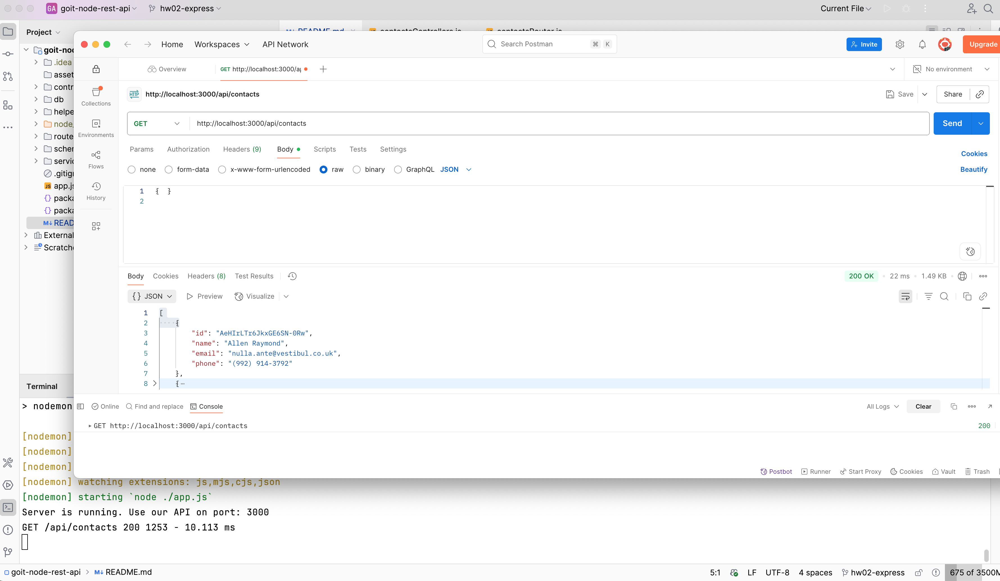

## POST /api/contacts

```bash
{ "name": "John Doe", "email": "john.doe@example.com", "phone": "(123) 456-7890" }
```

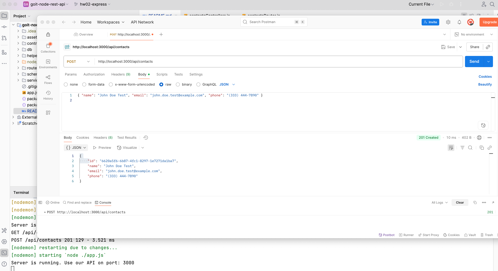

## GET /api/contacts/:id

### Знайдено

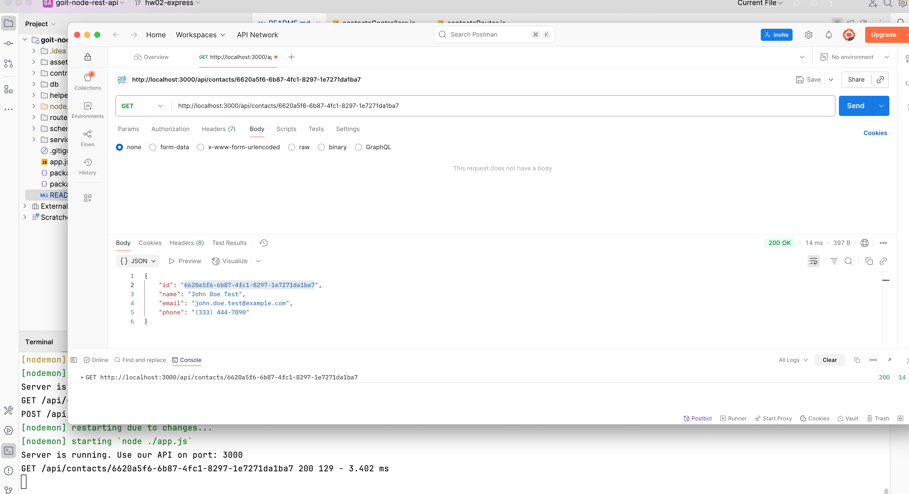

### Не знайдено

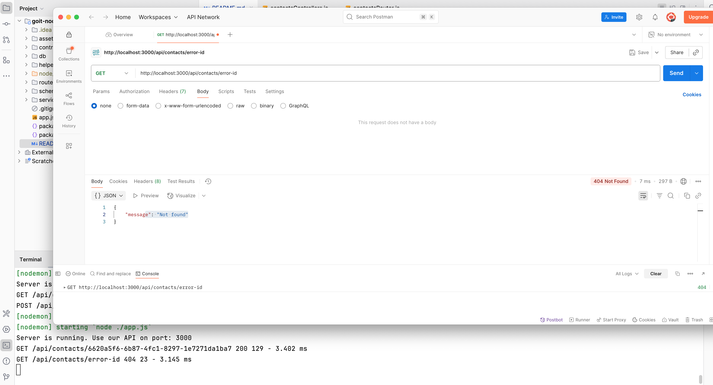

## DELETE /api/contacts/:id

### Видалено

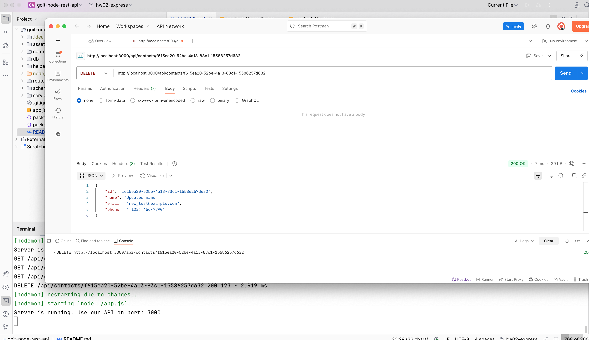

### Не знайдено

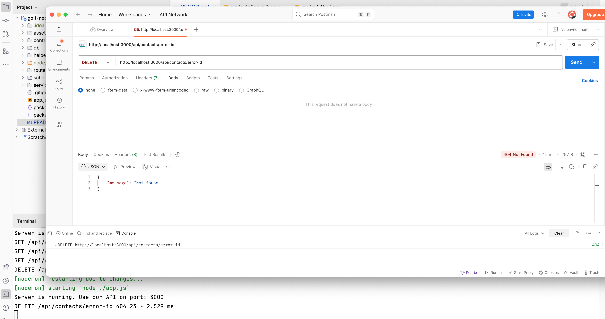

## POST /api/contacts

### Немає name

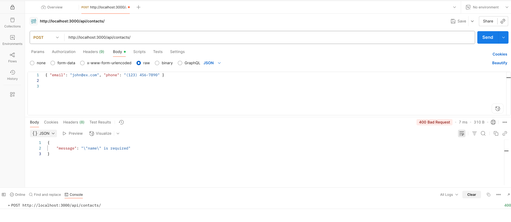

### Немає phone

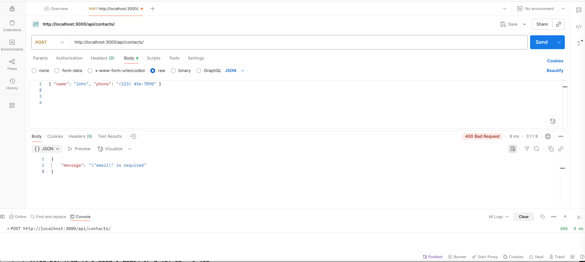

### Невірний email

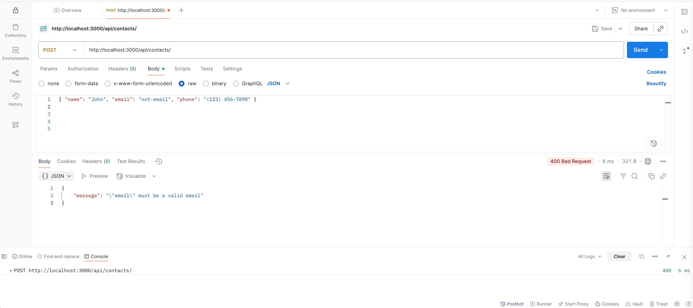

### Невірний phone

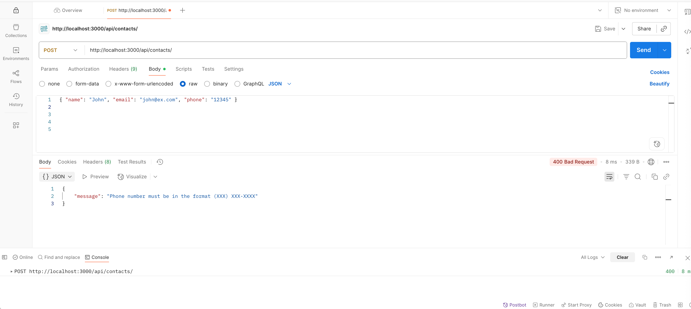

## PUT /api/contacts/:id

### Оновлено

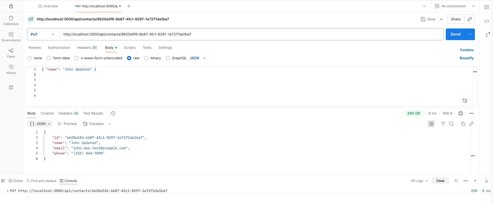

### Пусте тіло

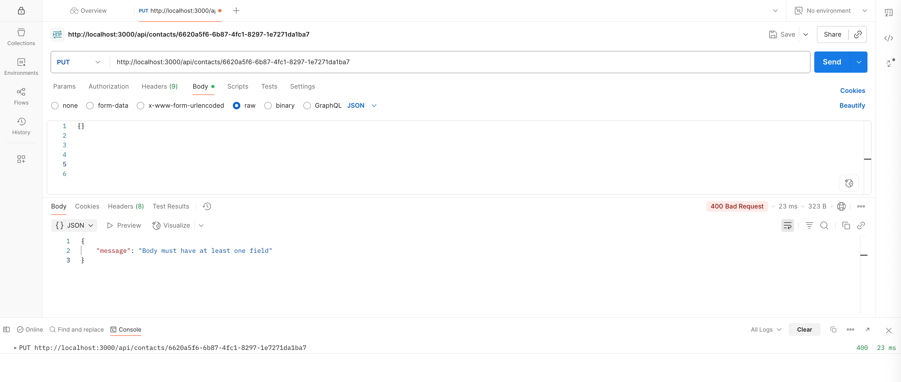

### Невалідний phone

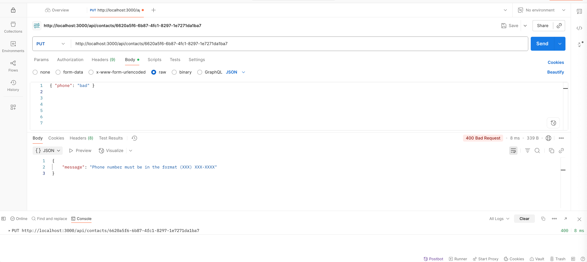

### Невалідний email

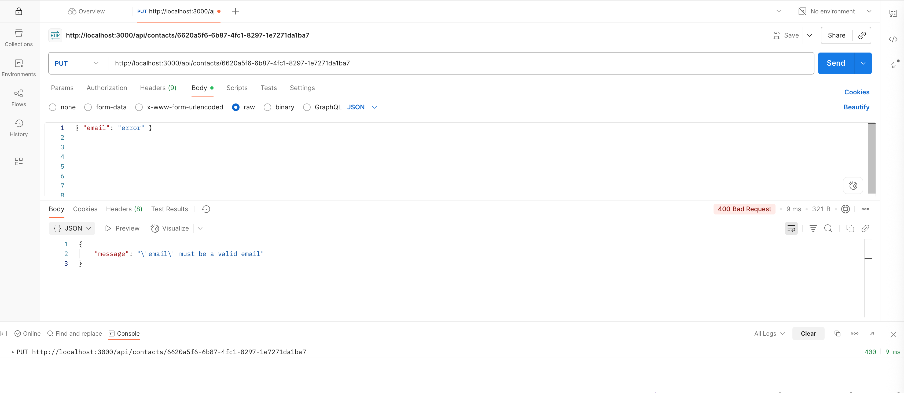

### Невалідний name

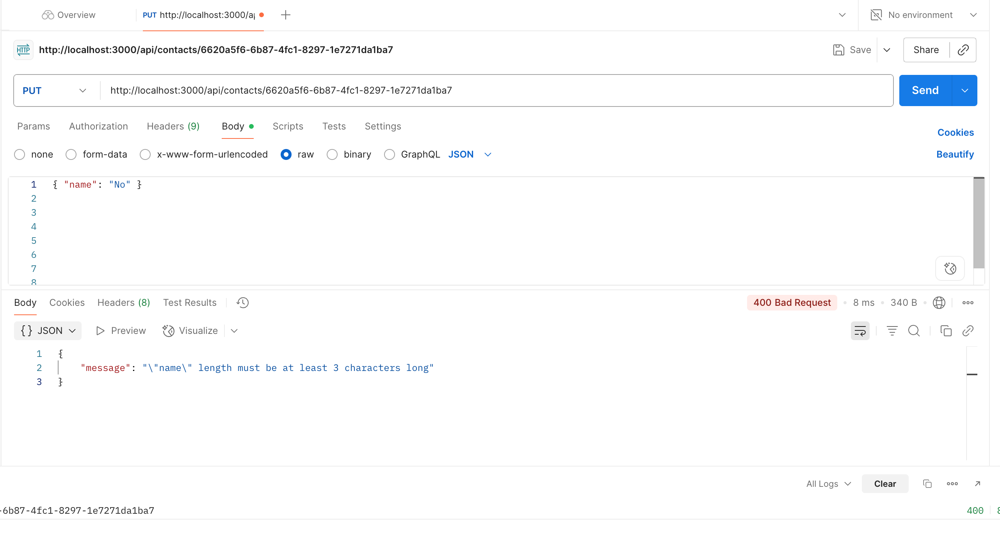