# goit-node-rest-api

## darinakhalina / goit-node-rest-api

### Гілка 03-postgresql
https://goit-node-rest-api-06hj.onrender.com

## Запуск


### Встанови залежності

```bash
npm install
```

## Створи файл .env

```bash
DATABASE_DIALECT=postgres
DATABASE_NAME=name
DATABASE_USERNAME=username
DATABASE_PASSWORD=password
DATABASE_HOST=host
DATABASE_PORT=port
```

## Запусти веб-додаток

```bash
npm run start
```

## Запусти веб-додаток у режимі розробки

```bash
npm run dev
```

## Демо

### GET /api/contacts


### POST /api/contacts


### GET /api/contacts/:contactId

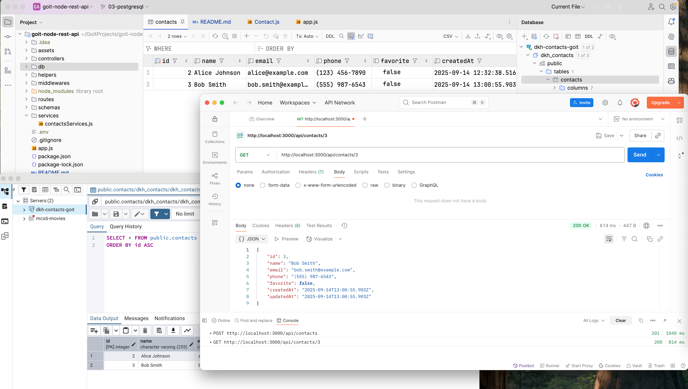

### PUT /api/contacts/:contactId

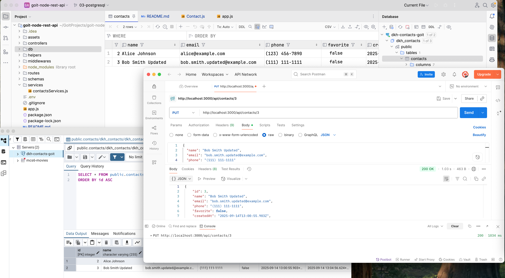

### PATCH /api/contacts/:contactId/favorite

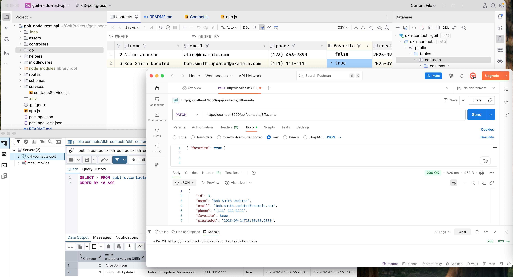

### DELETE /api/contacts/:contactId

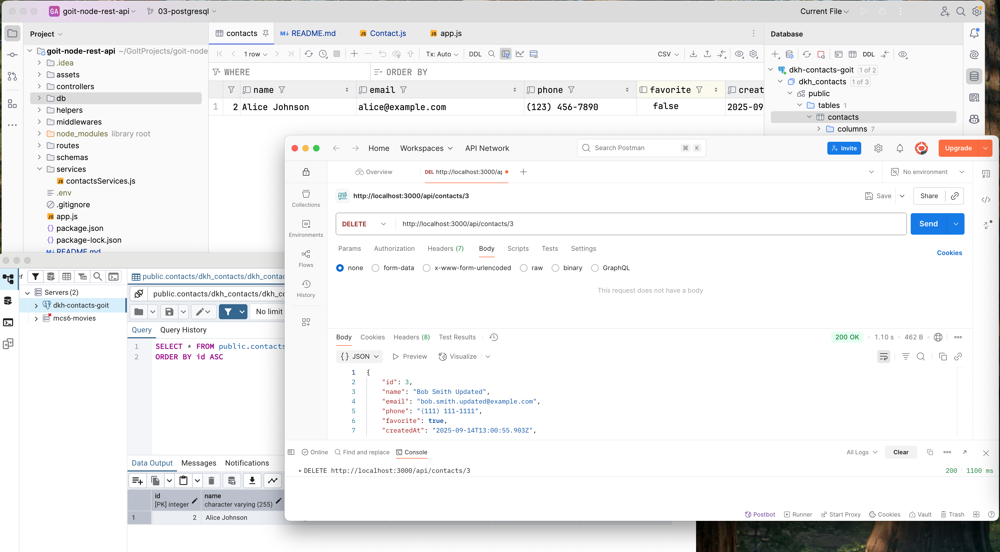

### GET /api/contacts/9999 → 404

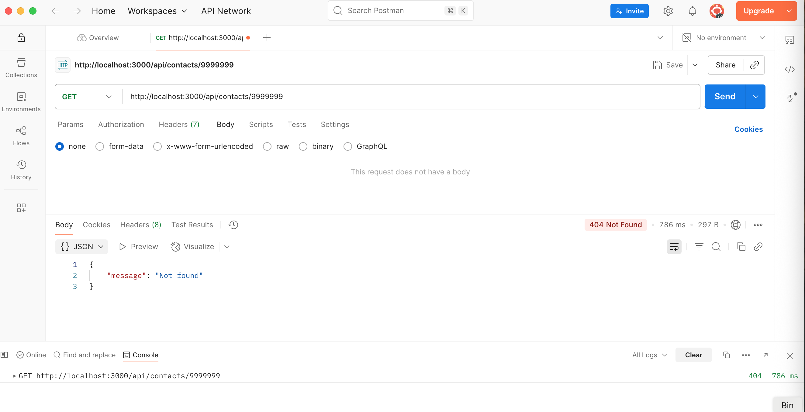

### DELETE /api/contacts/9999 → 404

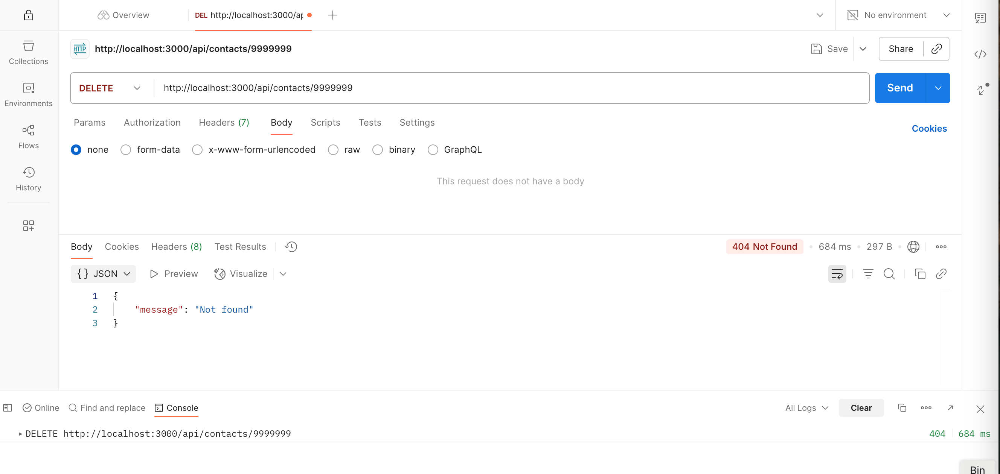

### PUT /api/contacts/9999 → 404

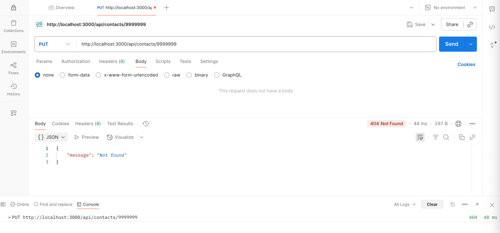

### PATCH /api/contacts/9999/favorite → 404

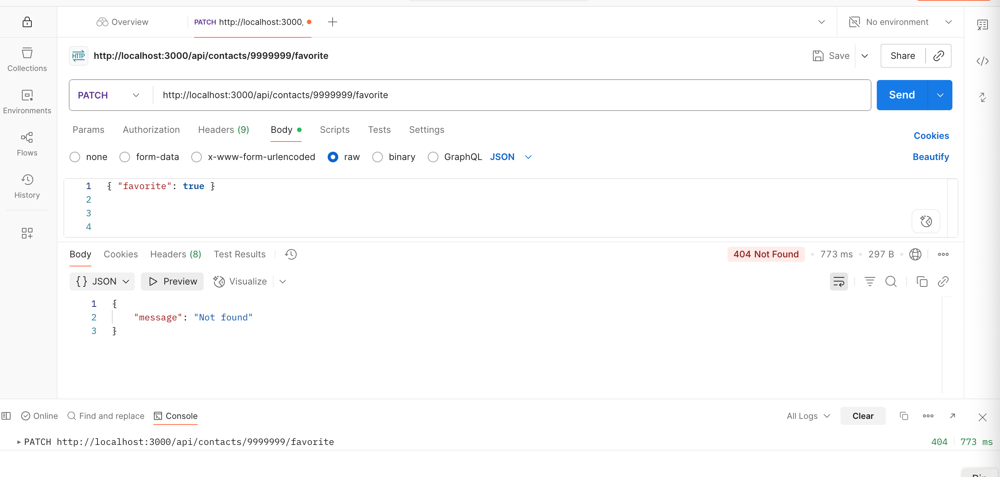

### POST /api/contacts з {} → 400

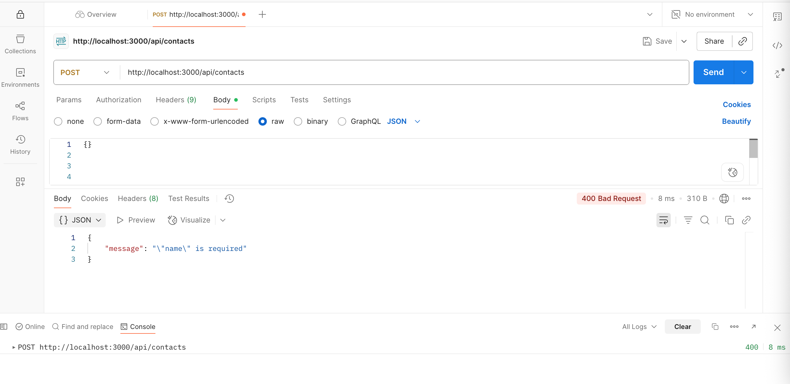

### POST /api/contacts з некоректним email → 400

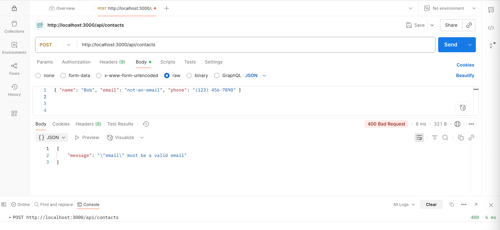

### POST /api/contacts з некоректним phone → 400

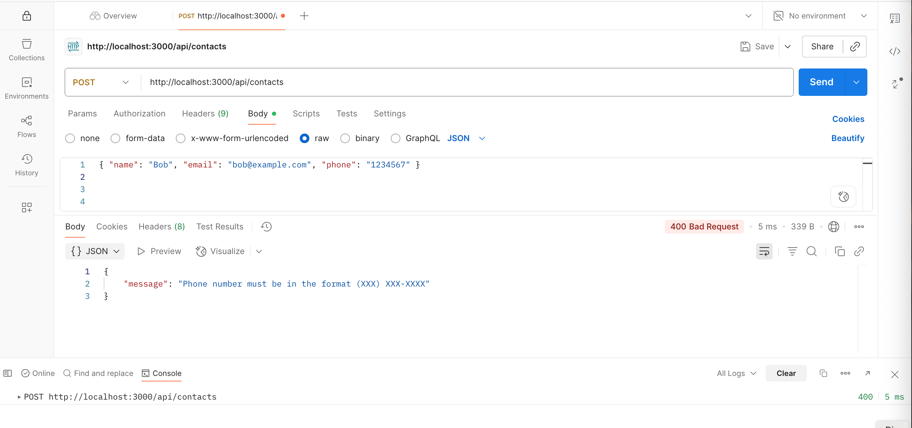

### PATCH /api/contacts/{id}/favorite з {} → 400

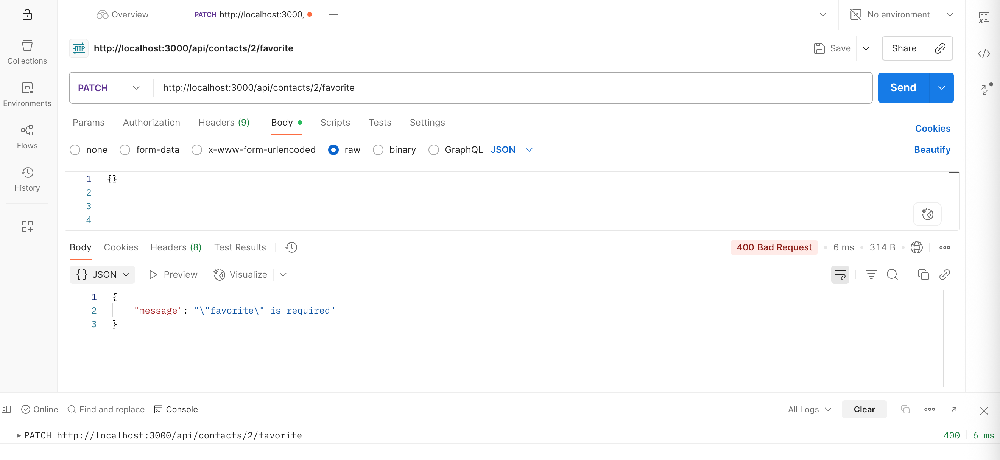
