# goit-node-rest-api

## darinakhalina / goit-node-rest-api

### Гілка hw06-email

https://goit-node-rest-api-hw-6.onrender.com

## Запуск

### Встанови залежності

```bash
npm install
```

## Створи файл .env

```bash
DATABASE_DIALECT=postgres
DATABASE_NAME=name
DATABASE_USERNAME=username
DATABASE_PASSWORD=password
DATABASE_HOST=host
DATABASE_PORT=port
JWT_SECRET=secret
UKR_NET_EMAIL=email
UKR_NET_PASSWORD=password
APP_BASE_URL=http://localhost:3000
```

## Запусти веб-додаток

```bash
npm run start
```

## Запусти веб-додаток у режимі розробки

```bash
npm run dev
```

## Запустити тести

```bash
npm run test
```

## Демо

### POST auth/register

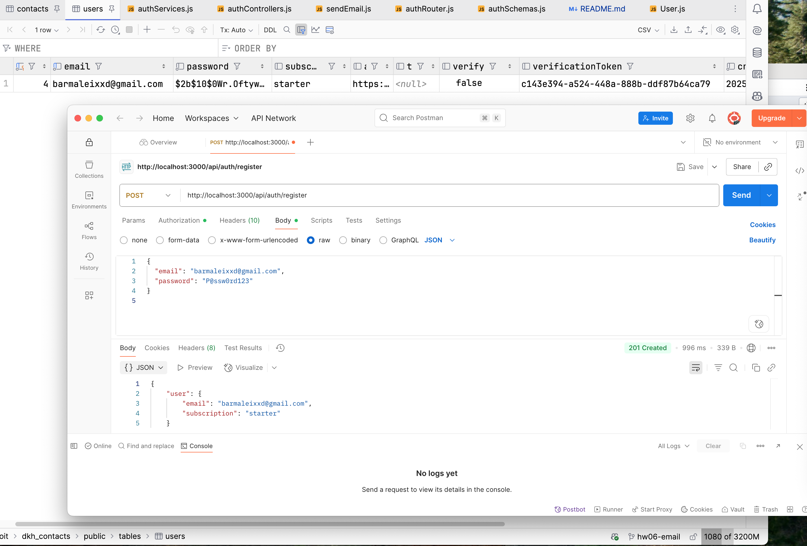

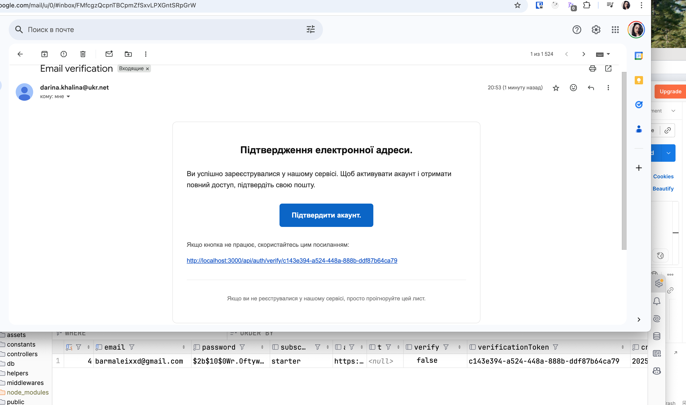

### POST auth/login without verification

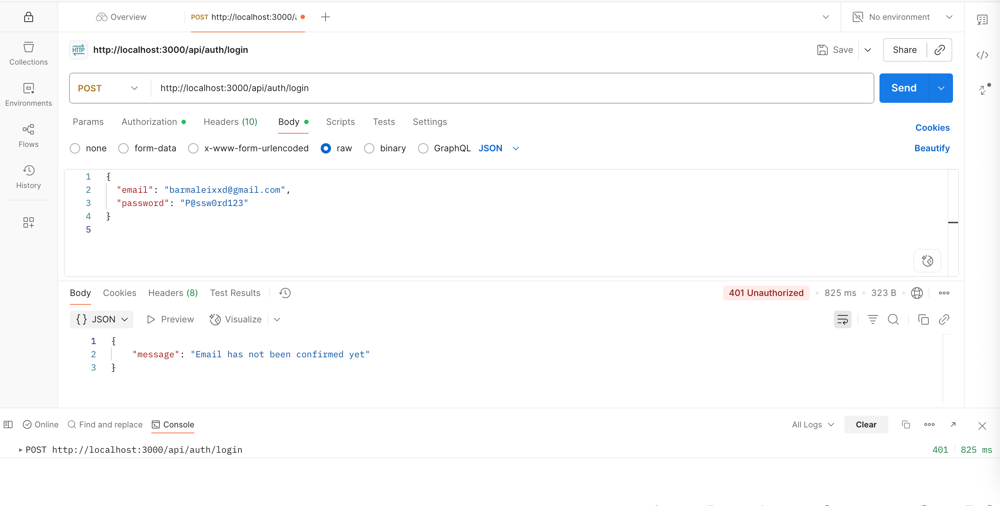

### POST auth/login with verification

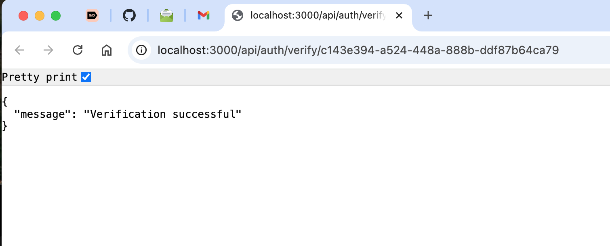

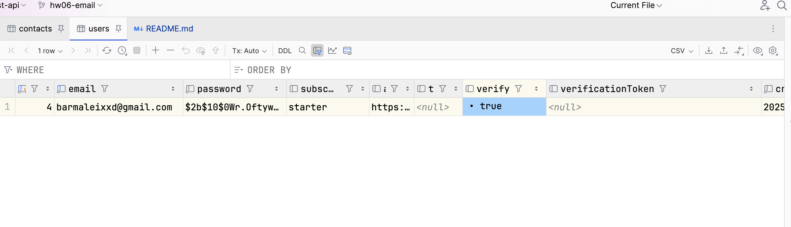

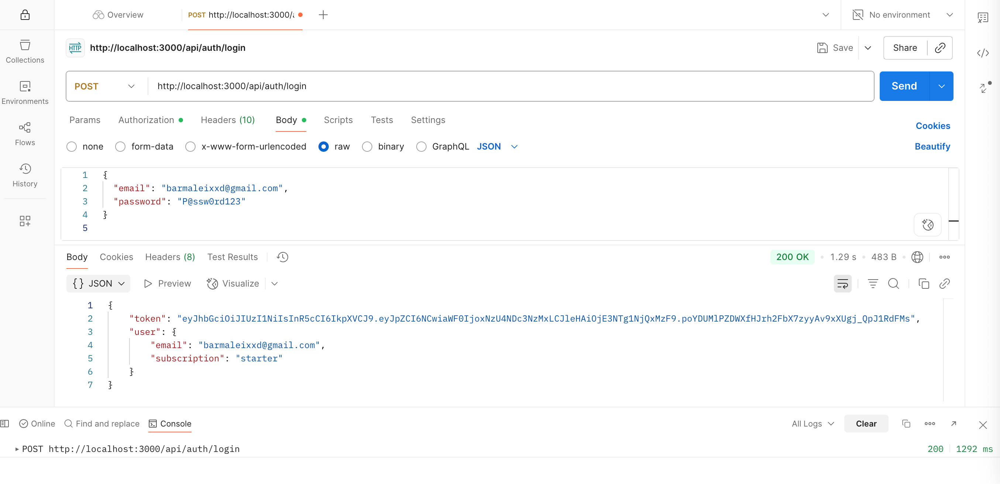

### Verification error with same token

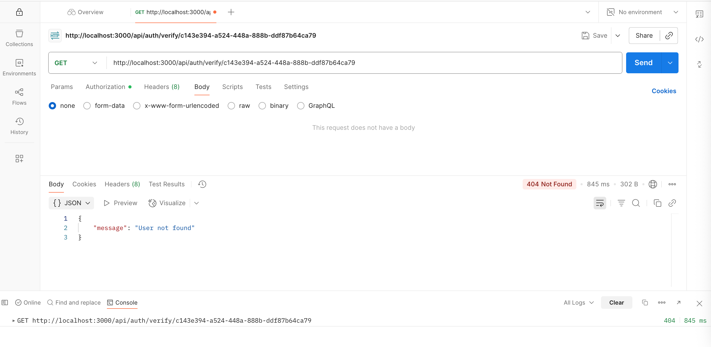

### GET auth/current

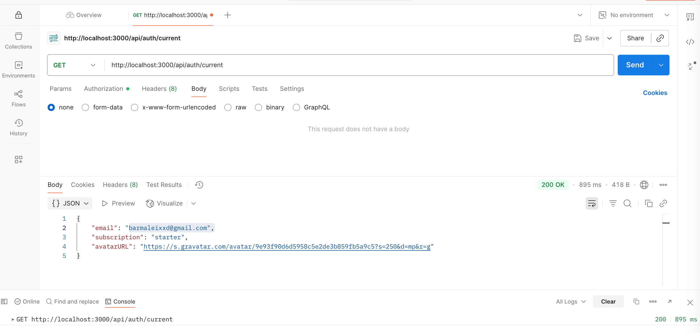

### POST auth/verify

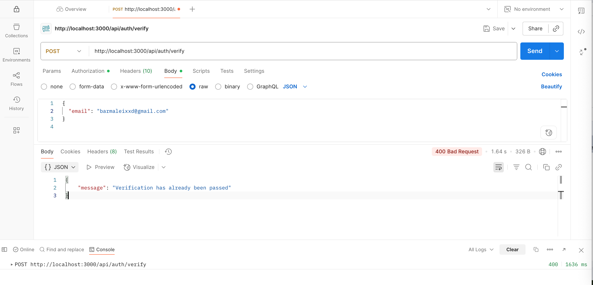


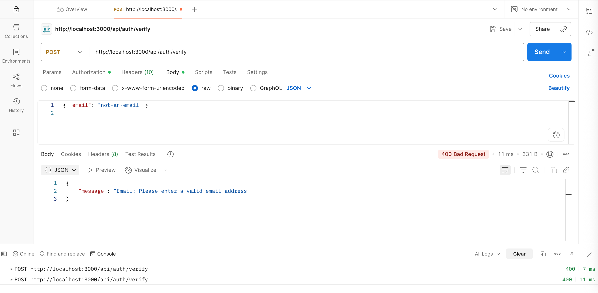

### When user exists but is not verified yet POST auth/verify

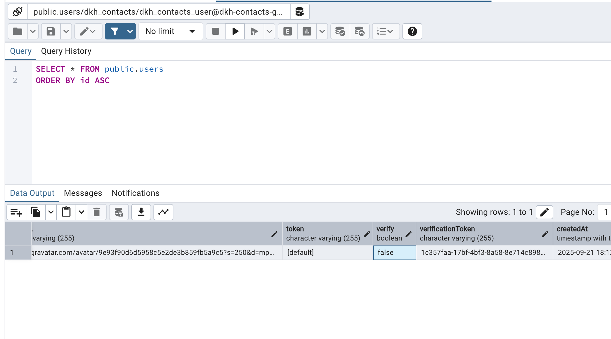

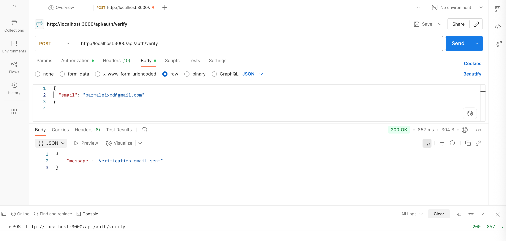

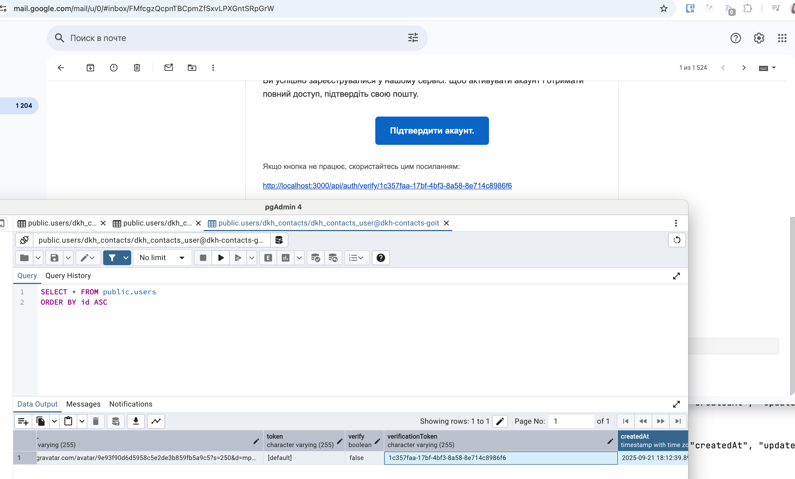