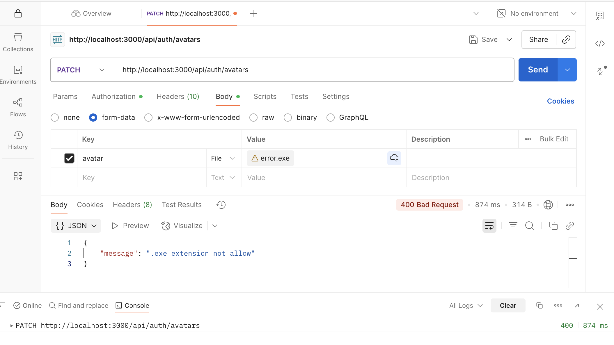

# goit-node-rest-api

## darinakhalina / goit-node-rest-api

### Гілка hw05-avatars
https://goit-node-rest-api-hw05.onrender.com

## Запуск

### Встанови залежності

```bash
npm install
```

## Створи файл .env

```bash
DATABASE_DIALECT=postgres
DATABASE_NAME=name
DATABASE_USERNAME=username
DATABASE_PASSWORD=password
DATABASE_HOST=host
DATABASE_PORT=port
JWT_SECRET=secret
```

## Запусти веб-додаток

```bash
npm run start
```

## Запусти веб-додаток у режимі розробки

```bash
npm run dev
```

## Запустити тести

```bash
npm run test
```

## Демо


### Tests


### POST auth/register


### POST auth/login


### GET auth/current


### PATCH auth/avatars


### Errors





