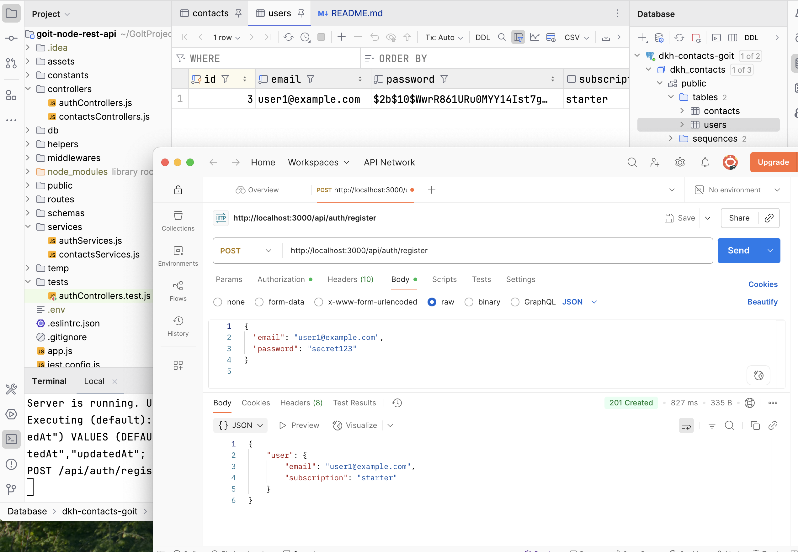
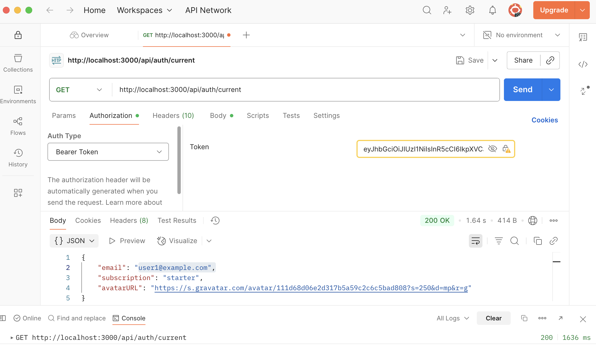

# goit-node-rest-api

## darinakhalina / goit-node-rest-api

### Гілка 04-auth
https://goit-node-rest-api-hw-04.onrender.com

## Запуск

### Встанови залежності

```bash
npm install
```

## Створи файл .env

```bash
DATABASE_DIALECT=postgres
DATABASE_NAME=name
DATABASE_USERNAME=username
DATABASE_PASSWORD=password
DATABASE_HOST=host
DATABASE_PORT=port
JWT_SECRET=secret
```

## Запусти веб-додаток

```bash
npm run start
```

## Запусти веб-додаток у режимі розробки

```bash
npm run dev
```


## Демо

### POST /api/auth/register




### POST /api/auth/login


### GET /api/auth/current




### POST /api/auth/logout


### PATCH /api/auth/subscription


### GET /api/contacts/


### GET /api/contacts/:id


### POST /api/contacts/


### PUT /api/contacts/:id


### PATCH /api/contacts/:id/favorite


### DELETE /api/contacts/:id


### Basic pagination


### Second page


### Filter by favorite (true)


### Search


### Combined filter (favorite + name)


### Empty result


### Not authorized


